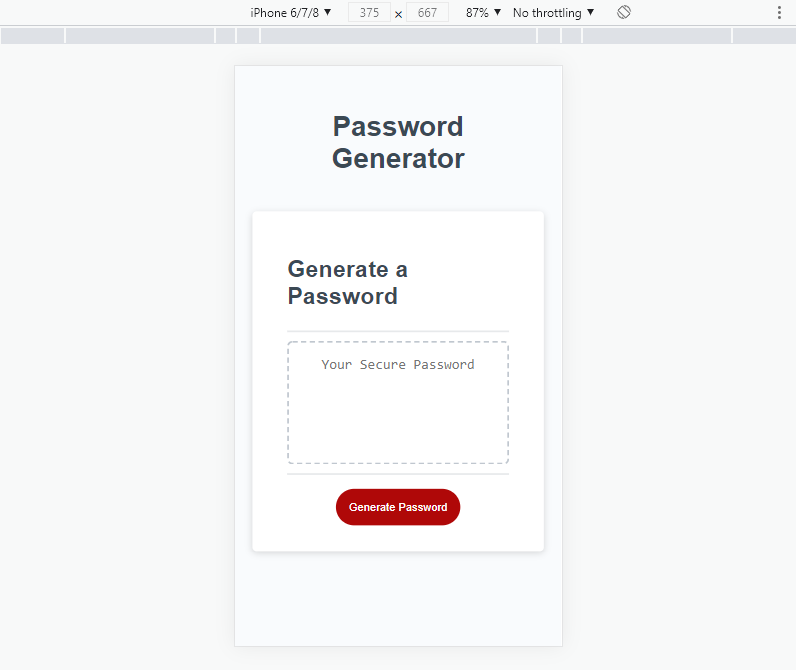
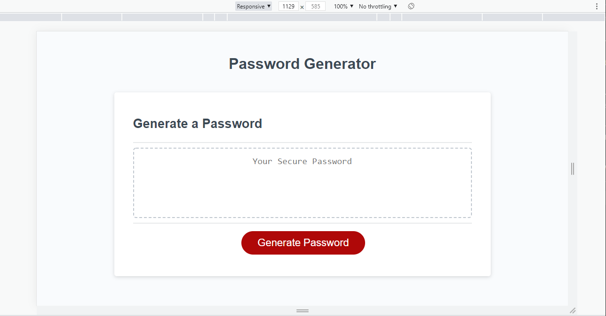

# password-generator

This application allows users to generate random passwords based on criteria that they've selected. This app runs in the browser and will features dynamically updated HTML powered by JavaScript. It has a clean and polished, responsive user interface that adapts to multiple screen sizes.

## Satisfied Acceptance Criteria

```
GIVEN I need a new, secure password

WHEN I click the button to generate a password
THEN I am presented with a series of prompts for password criteria

WHEN prompted for password criteria
THEN I select which criteria to include in the password

WHEN prompted for the length of the password
THEN I choose a length of at least 8 characters and no more than 128 characters

WHEN asked for character types to include in the password
THEN I confirm whether or not to include lowercase, uppercase, numeric, and/or special characters

WHEN I answer each prompt
THEN my input should be validated and at least one character type should be selected

WHEN all prompts are answered
THEN a password is generated that matches the selected criteria

WHEN the password is generated
THEN the password is either displayed in an alert or written to the page
```

### Mobile Screenshot



### Desktop Screenshot



## Application Location

[https://bravotango.github.io/password-generator/](https://bravotango.github.io/password-generator/)
